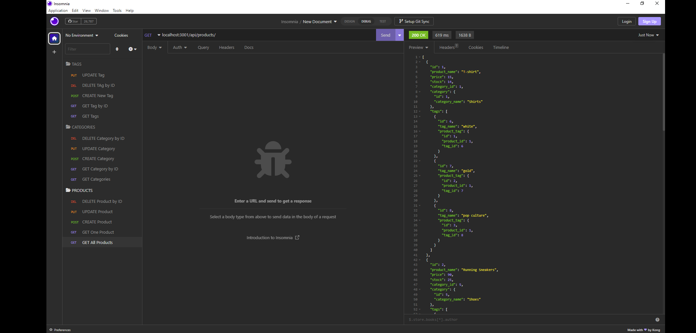
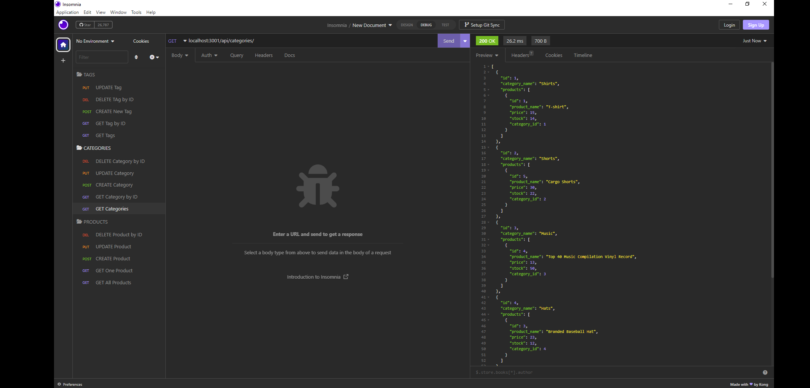
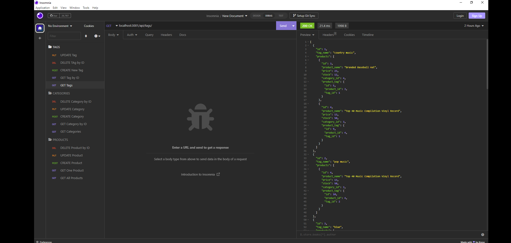
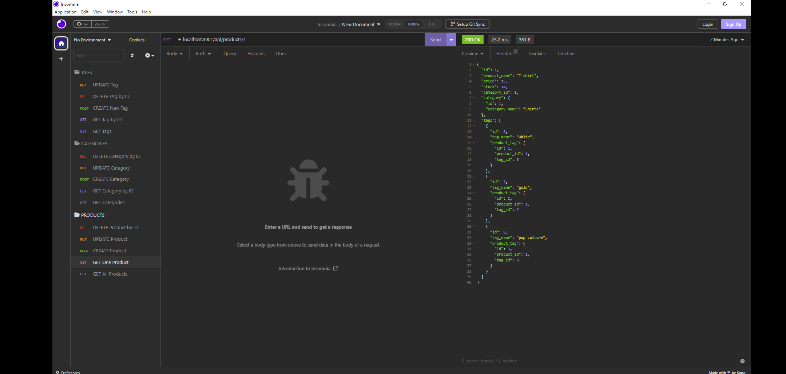
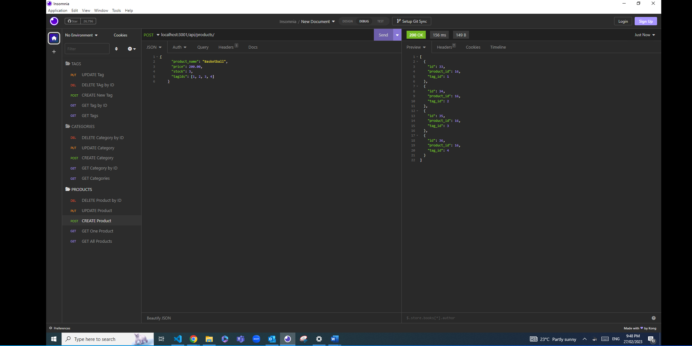
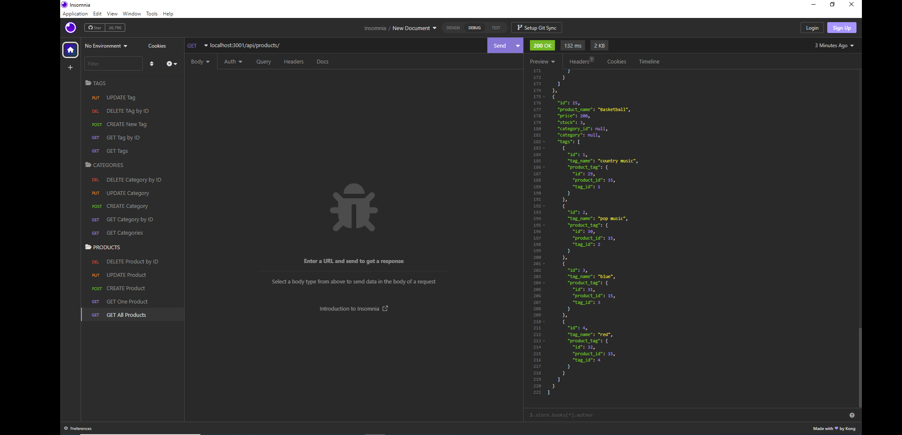
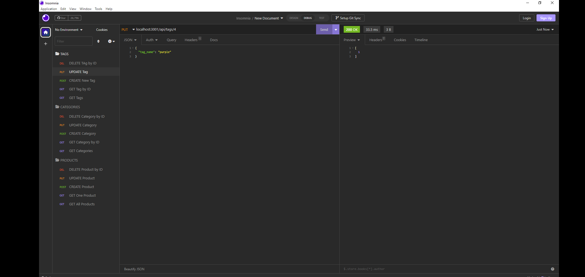
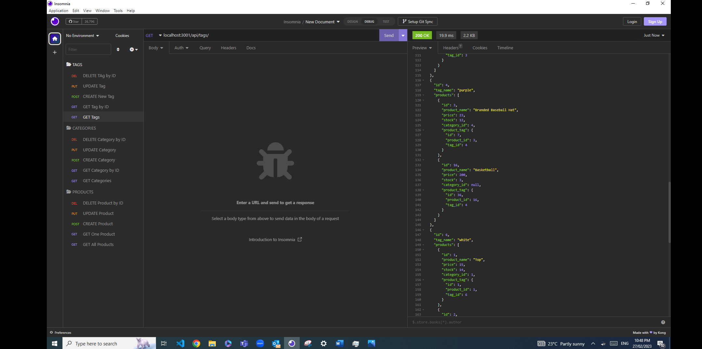
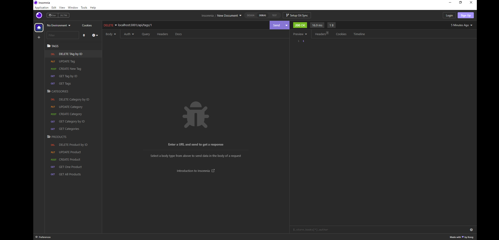
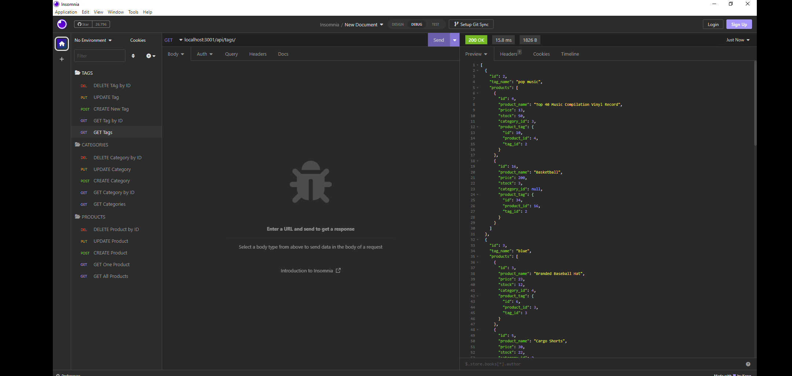

# E-Commerce Back End site

This back end site allows managers in charge of internet retail companies compete with other e-commerce companies.

Once I add my database name, username, and password for the database, I am able to connect to that database using Sequelize and after I enter schema and seed commands
 a development database is created and is populated with data.
When I enter the command to invoke the application, my server is started and the Sequelize models are synced to the database.
After that, I can see folders for categories, products, or tags by opening API GET routes in Insomnia Core and the data for each of these folders is displayed.
Finally I am able to successfully create, update, and delete data in my database.

Link to the walk trough video:
https://drive.google.com/file/d/1ol3ncgDwuYBip_bKZqW_woCylqm3FmcZ/view

The URL of the GitHub repository:
https://github.com/katita81/eComerceBE.git

